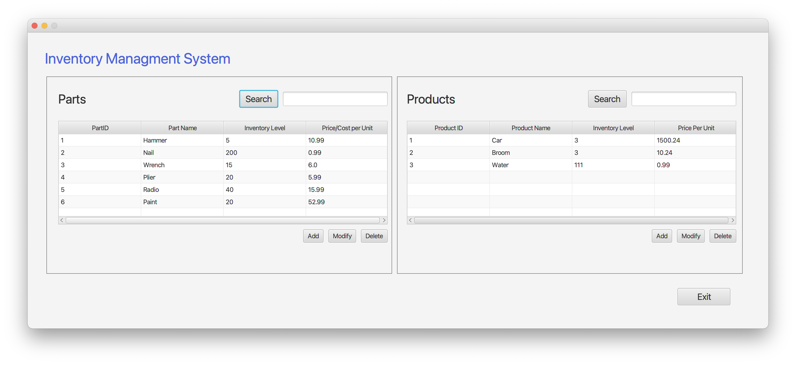
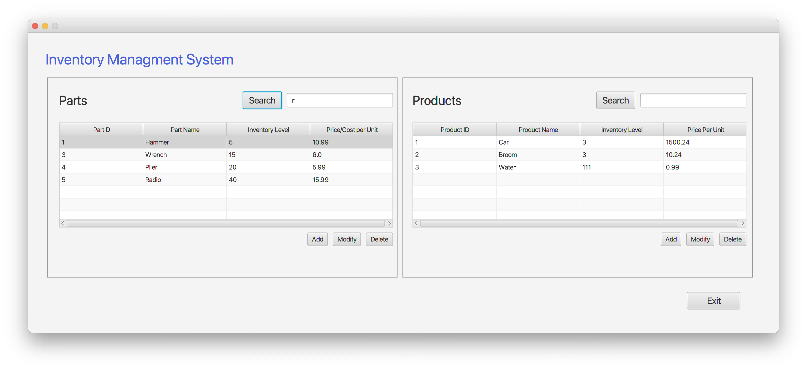
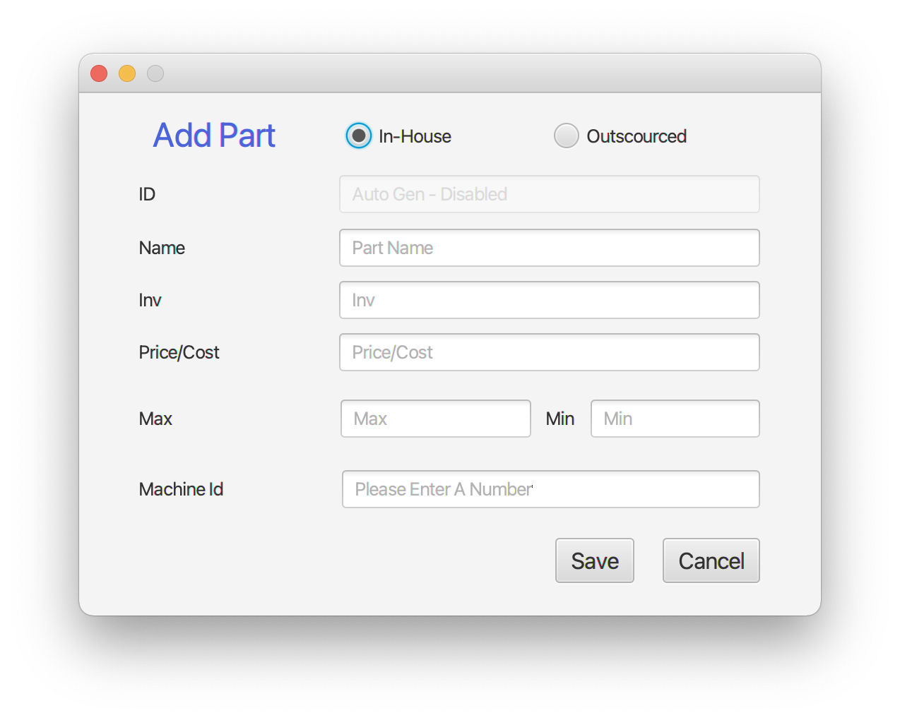
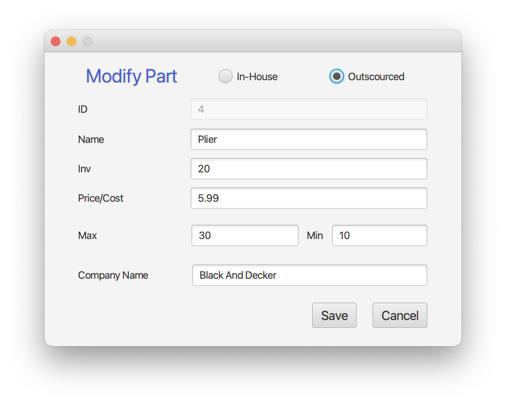
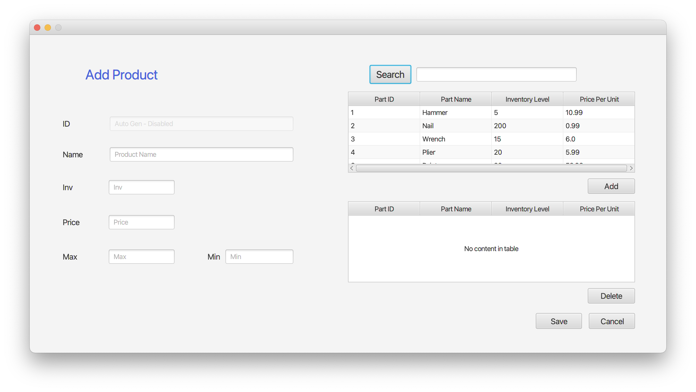
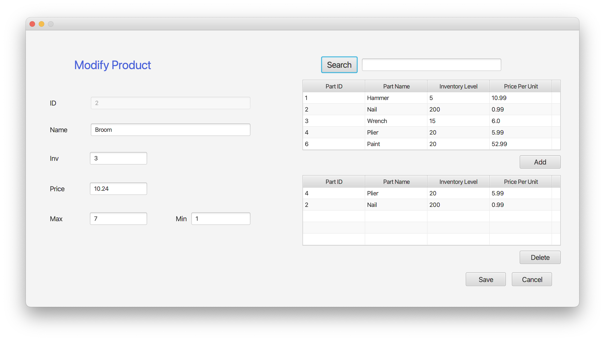

# Inventory System
This is the final project for my Software 1 class at Western Governor's University.
 We were tasked with creating a GUI desktop CRUD application where a user can create 
 both parts and products.  The idea is that a product is made up of at least one or 
 more parts, with no duplicate parts. There is a search functionality which 
 lets you search for parts or products. You can add or delete parts and products, 
 as well as edit the composition of a product, and a part. 
 This was created with Java 8 and JavaFX.

## Improvements
This was one of the first major projects I did at WGU. Before this I mainly worked
 in web development with Ruby on Rails and React, so this was an exciting challenge. 
 I would like to go in an refactor some of the code, and seperate out functionality
into resuable packages to make it more maintainable. I would also really like to 
put the search functionality into it's own package and change it from a linear to 
binary search as that will be much more efficient. I was planning on adding a SQL 
databse to make the object storage more permanent, but I'm going to tackle that 
exact challenge for another class so I'll hold off on that.
This was the first major desktop project I've done in Java
and it was fun! If you have any comments or questions I'd 
love to hear from you!

## Menu Screenshots
Below are screenshots that showcase the functionality of the program, as well as 
a link to a YouTube demonstration that shows off what this program can do.

[Link to demo - YouTube](https://www.youtube.com/watch?v=0Szv6RSMH38&feature=youtu.be)

### Main Menu & Search

### Adding & Modifying Part

### Adding & Modifying Product

### Delete Confirmations

